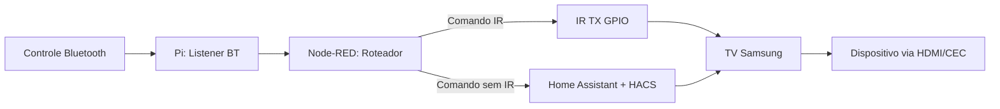

# Arquitetura de Controle (Fluxos de Comando)

Este documento descreve os dois caminhos de controle e o roteamento
entre IR e HA/HACS para minimizar latencia.

## Fluxo Rapido (Baixa Latencia)
Bluetooth -> Pi -> IR -> TV -> Dispositivo (quando aplicavel)

## Fluxo Estendido (Funcoes sem IR)
Bluetooth -> Pi -> Node-RED -> Home Assistant (HACS) -> TV

## Regra de Roteamento
- Se existir comando equivalente via IR, usar IR.
- Se nao existir, usar HA/HACS.

## Pontos de Latencia
- Entrada BT no Pi.
- Roteamento no Node-RED.
- Execucao no HA/HACS.
- Aplicacao do comando na TV.

## Log e Medicao
- Registrar timestamp no recebimento do comando (BT).
- Registrar timestamp no envio (IR ou HA).
- Medir tempo fim-a-fim por tipo de comando.

---

## Diagrama (Mermaid)

