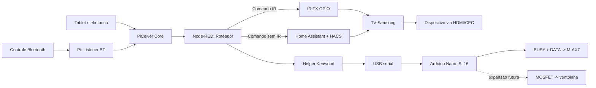

# Control Flows

## Objetivo

Descrever os caminhos de comando e a regra de roteamento entre IR e
Home Assistant para minimizar latencia.

A interface touch externa, seu relacionamento com o controle Bluetooth e a
evolucao de tablet para tela dedicada estao definidas em
[`external-control-interface.md`](external-control-interface.md).

## Fluxo rapido

Bluetooth -> Pi -> IR -> TV -> Dispositivo

Uso recomendado:

- navegacao
- comandos simples
- funcoes com equivalente IR

## Fluxo estendido

Bluetooth -> Pi -> Node-RED -> Home Assistant (HACS) -> TV

Uso recomendado:

- funcoes exclusivas da TV Samsung
- acoes sem equivalente IR local

## Regra de roteamento

- se existir comando equivalente via IR, usar IR
- usar HA/HACS apenas quando IR nao cobrir a funcao
- Node-RED decide o caminho por tipo de comando
- para a TV Samsung Q60B, usar somente os codigos IR marcados como validados em
  [`../hardware/samsung-gq55q60bau-ir.md`](../hardware/samsung-gq55q60bau-ir.md);
  HDMI discreto permanece fora do fluxo ate captura local

## Pontos de latencia

- recepcao Bluetooth no Pi
- roteamento no Node-RED
- processamento no HA/HACS
- aplicacao do comando na TV

## Controle Bluetooth G20S PRO

Estado em `2026-07-27`: implementado em producao no Raspberry Pi `piht`.

O controle G20S PRO esta pareado como `69:98:98:22:F7:43` e expoe tres
interfaces HID. O servico `piceiver-g20s.service` usa a interface
`G20S PRO Keyboard`, detectada dinamicamente por nome e MAC, em vez de depender
do numero instavel de `/dev/input/eventN`.

Fluxo atual:

```text
G20S PRO -> /dev/input/event* -> g20s_control.py -> MQTT + piceiver_control.py
```

O listener publica cada acao semantica em `piceiver/control/action` com origem,
MAC, codigo da tecla e evento. Em paralelo, o executor local valida a acao e
executa apenas o conjunto permitido.

Acoes executadas localmente:

- `volume_up` e `volume_down`: CamillaDSP, passo de `2 dB`, limitado entre
  `-80 dB` e `0 dB`;
- `toggle_mute`: CamillaDSP;
- `select_tv`, `select_spotify` e `power_off`: reaproveitam
  `scripts/audio_source_switch.py` e preservam a arquitetura permanente
  TV/Spotify.

Acoes ainda apenas encaminhadas para consumidores futuros: navegacao, OK,
back, home curto, play/pause curto, next, previous e `voice_button_pressed`.

Mapeamento validado:

| Botao | Acao |
|---|---|
| MUTE | `toggle_mute` |
| VOL+ / VOL- | `volume_up` / `volume_down` |
| HOME curto | `open_home` |
| HOME longo, `1.0 s` | `select_tv` |
| PLAY/PAUSE curto | `toggle_playback` |
| PLAY/PAUSE longo, `1.0 s` | `select_spotify` |
| POWER longo, `1.5 s` | `power_off` |
| Setas, OK e BACK | acoes semanticas de navegacao |
| MIC | `voice_button_pressed` |

O listener descarta eventos HID com mais de `2 s` de atraso. Isso evita que
uma fila acumulada por botoes de volume segurados continue alterando o volume
depois que o botao ja foi solto.

## Log e medicao

- registrar timestamp na chegada do comando
- registrar timestamp no envio por IR ou HA
- medir tempo fim-a-fim por classe de comando

## Estado da TV Box para comandos de energia

O Raspberry Pi mantem o arquivo local
`/home/elvis/PiCeiver/runtime/tvbox-status.json`, destinado ao Node-RED.
Ele e a fonte de decisao antes de emitir qualquer comando de energia que possa
funcionar como toggle.

Formato do arquivo (somente estado atual e hora da verificacao):

```json
{"status":"active","checked_at":"2026-07-26T19:48:36+02:00"}
```

- `active`: pelo menos uma das tres sondas ICMP para `192.168.178.29`
  respondeu; nao enviar comando de despertar/toggle.
- `inactive`: as tres sondas falharam; o Node-RED pode seguir pelo fluxo de
  despertar previsto.
- arquivo ausente, malformado ou com hora antiga: tratar como estado
  **desconhecido** e nao enviar toggle; registrar erro e pedir nova leitura.

O monitor e `tvbox-status.timer` do systemd. Ele executa a cada 20 segundos,
inclusive apos reboot, e grava o JSON de forma atomica (arquivo temporario +
rename), para que o Node-RED nunca leia um conteudo parcial. O custo maximo e
de tres pacotes ICMP curtos a cada execucao; nao ha ping continuo.

## Controle do amplificador Kenwood M-AX7

O conector antes tratado como `trigger 3V` foi identificado e validado como o
barramento Kenwood `SL16`: `TIP=BUSY`, `RING=DATA` e `SLEEVE=GND`, em logica de
aproximadamente `5 V`.

Fluxo adotado:

```text
Node-RED -> helper Kenwood -> USB serial -> Arduino Nano -> SL16 -> M-AX7
```

O firmware ATmega328P ja reproduziu com sucesso ligar, desligar e selecionar
dois ou quatro canais. O Pi alimenta e controla o Nano pelo mesmo cabo USB; o
Nano gera BUSY e DATA com a temporizacao validada.
Na ativacao, Node-RED coordena energia, helper e
liberacao gradual do mute do CamillaDSP. No shutdown, CamillaDSP deve ser
silenciado antes de `power_off`.

Detalhes medidos e plano de implementacao:

- [`../hardware/kenwood-ax7-system-control.md`](../hardware/kenwood-ax7-system-control.md)
- [`../hardware/kenwood-sl16-pi-arduino.md`](../hardware/kenwood-sl16-pi-arduino.md)

## Diagrama


