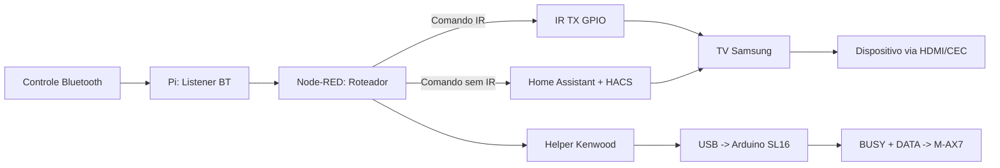

# Control Flows

## Objetivo

Descrever os caminhos de comando e a regra de roteamento entre IR e
Home Assistant para minimizar latencia.

## Fluxo rapido

Bluetooth -> Pi -> IR -> TV -> Dispositivo

Uso recomendado:

- navegacao
- comandos simples
- funcoes com equivalente IR

## Fluxo estendido

Bluetooth -> Pi -> Node-RED -> Home Assistant (HACS) -> TV

Uso recomendado:

- funcoes exclusivas da TV Samsung
- acoes sem equivalente IR local

## Regra de roteamento

- se existir comando equivalente via IR, usar IR
- usar HA/HACS apenas quando IR nao cobrir a funcao
- Node-RED decide o caminho por tipo de comando

## Pontos de latencia

- recepcao Bluetooth no Pi
- roteamento no Node-RED
- processamento no HA/HACS
- aplicacao do comando na TV

## Log e medicao

- registrar timestamp na chegada do comando
- registrar timestamp no envio por IR ou HA
- medir tempo fim-a-fim por classe de comando

## Controle do amplificador Kenwood M-AX7

O conector antes tratado como `trigger 3V` foi identificado e validado como o
barramento Kenwood `SL16`: `TIP=BUSY`, `RING=DATA` e `SLEEVE=GND`, em logica de
aproximadamente `5 V`.

Fluxo proposto:

```text
Node-RED -> helper Kenwood -> USB serial -> Arduino SL16 -> M-AX7
```

O Arduino e o caminho inicial recomendado e ja reproduziu com sucesso ligar,
desligar e selecionar dois ou quatro canais. Na ativacao, Node-RED coordena
energia, comando serial e liberacao gradual do mute do CamillaDSP. No shutdown,
CamillaDSP deve ser silenciado antes do comando `f`.

Detalhes medidos e plano de implementacao:

- [`../hardware/kenwood-ax7-system-control.md`](../hardware/kenwood-ax7-system-control.md)

## Diagrama


