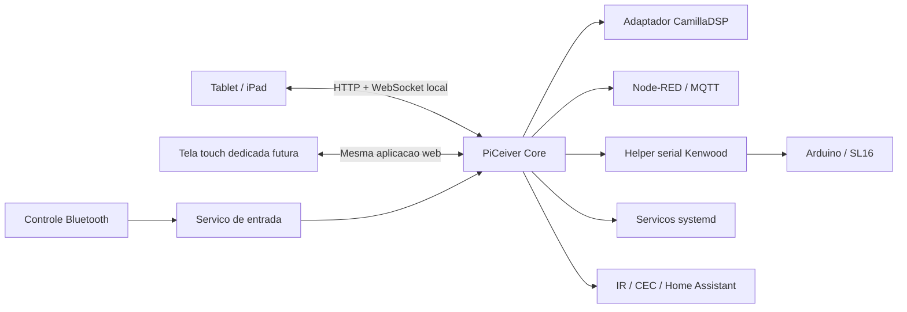

# Interface Externa de Controle

## Status

Conceito arquitetural adotado para implementacao futura. A primeira versao
deve reutilizar um tablet Android. Uma tela touch dedicada ligada ao Raspberry
Pi permanece como evolucao possivel, sem exigir outra interface ou outra
logica de controle.

## Objetivo

Criar o painel cotidiano do PiCeiver: uma interface unica, simples e adequada
ao uso a distancia que apresente o estado geral do sistema e permita operar
fontes, volume, mute, energia e funcoes principais.

A interface deve fazer a pilha existente se comportar como um unico receiver,
sem reimplementar os componentes especializados que ja resolvem audio,
automacao e controle de hardware.

## Decisao principal

A interface sera uma aplicacao web local, servida pelo Raspberry Pi e aberta
em tela cheia por um dispositivo externo.

Ordem planejada de uso:

1. tablet Android existente para prototipo e primeira instalacao;
2. iPad antigo como cliente opcional, condicionado a teste de compatibilidade;
3. tela touch HDMI ou DSI ligada ao Pi como instalacao dedicada futura;
4. navegador de celular ou computador como acesso auxiliar.

Todos os clientes devem abrir a mesma aplicacao. O tablet ou display nao deve
conter a automacao do sistema nem ser necessario para o funcionamento do
audio.

## Principios

- o Raspberry Pi continua sendo o centro do audio e do controle;
- CamillaDSP continua sendo o unico controlador de volume;
- a TV continua sendo o hub de video;
- a interface e um cliente substituivel, e nao o cerebro do sistema;
- controle touch e controle remoto Bluetooth usam as mesmas acoes semanticas;
- a falha ou o desligamento da tela nao pode interromper o audio;
- a tela nunca deve apresentar estado antigo como se ainda fosse atual;
- operacoes perigosas devem exigir confirmacao ou pressionamento longo;
- configuracao tecnica do DSP permanece separada da operacao cotidiana.

## Arquitetura proposta



### PiCeiver Core

O nucleo de controle sera a fonte oficial do estado operacional. Ele deve:

- receber acoes da tela, do controle Bluetooth e de outras integracoes;
- validar e serializar comandos;
- executar sequencias de ligar, desligar e trocar fonte;
- conversar com CamillaDSP, Node-RED, MQTT, systemd e o helper Kenwood;
- publicar estado e erros em tempo real para todas as interfaces;
- manter a interface desacoplada dos detalhes de cada ferramenta.

Exemplo de estado logico:

```yaml
power: on
source: tv
volume_db: -32.5
mute: false
amplifier: on
kenwood_mode: 4ch
fan: on
camilladsp: running
spotify: idle
tv_audio: active
connected: true
last_error: null
```

Exemplos de acoes comuns a touch e Bluetooth:

```text
volume_up
volume_down
toggle_mute
select_tv
select_spotify
select_pc
select_tvbox
select_satellite
select_switch
power_on
power_off
open_sources
open_diagnostics
```

O cliente nao deve precisar saber se uma acao usa WebSocket do CamillaDSP,
MQTT, serial USB, IR, CEC, Home Assistant ou `systemctl`.

O controle por voz e a camada de IA seguem a mesma regra: a IA solicita apenas
acoes semanticas tipadas, e o PiCeiver Core valida e executa essas acoes. O
fluxo de captura, chamadas de ferramentas, resposta sonora e seguranca esta em
[`voice-ai-control.md`](voice-ai-control.md).

## Papel dos componentes existentes

| Componente | Papel futuro |
|---|---|
| CamillaDSP | processamento multicanal, filtros, mixer, mute e volume |
| ALSA / alsaloop | transporte local de audio |
| Raspotify / librespot | Spotify Connect |
| Arduino | coprocessador do barramento Kenwood SL16 e ventilacao |
| Node-RED | integracoes, macros e automacoes modificaveis |
| MQTT | transporte local entre integracoes, enquanto for util |
| Home Assistant | dispositivos e funcoes especiais sem caminho local |
| CamillaGUI | configuracao e diagnostico tecnico do DSP |
| PiCeiver UI | interface cotidiana unica do usuario |

Node-RED deve ser mantido inicialmente. Sequencias criticas podem migrar
gradualmente para o PiCeiver Core quando a duplicacao ou a manutencao dos
fluxos justificar a mudanca.

## Experiencia de uso

### Tela principal

Deve mostrar apenas informacoes uteis no uso diario:

- fonte atual em destaque;
- volume em dB e estado de mute;
- estado geral de energia e do amplificador;
- modo Kenwood de 2 ou 4 canais;
- faixa e artista quando Spotify fornecer esses dados;
- indicadores discretos de DSP, rede, ventilacao e falhas.

### Seletor de fontes

O seletor deve usar botoes grandes e nomes reconheciveis:

```text
+-------------+-------------+
|     TV      |   Spotify   |
+-------------+-------------+
|     PC      |   TV Box    |
+-------------+-------------+
|  Satelite   |   Switch    |
+-------------+-------------+
```

Selecionar uma fonte representa uma intencao unica do usuario. O nucleo e
responsavel por executar a macro completa, incluindo mute, servicos, IR/CEC,
estado do amplificador e liberacao gradual do audio.

### Volume e energia

- usar botoes grandes de menos, mais e mute;
- slider de volume e opcional e deve evitar alteracao por toque acidental;
- desligar o sistema deve exigir pressionamento longo ou confirmacao;
- o estado de execucao deve ficar visivel durante sequencias demoradas;
- erros devem explicar o que falhou sem expor logs tecnicos na tela principal.

### Diagnostico

Uma area secundaria, protegida de acionamento acidental, pode mostrar:

- conexao com CamillaDSP;
- estado dos servicos de audio;
- conexao serial com o controlador Kenwood;
- ultima resposta SL16;
- temperatura e estado da ventoinha;
- conectividade MQTT, Home Assistant, IR e CEC;
- horario do ultimo erro e opcao de abrir detalhes.
- estado de voz (`ouvindo`, `pensando`, `executando` ou `falando`);
- disponibilidade do microfone e da API, sem expor credenciais;
- consumo estimado do recurso de IA.

Filtros, roteamento e configuracao completa do CamillaDSP permanecem no
CamillaGUI ou em ferramentas de manutencao.

## Tablet Android

O tablet Android e a plataforma preferida para a primeira versao porque ja
inclui tela touch, bateria, Wi-Fi e navegador. A aplicacao deve poder operar
em tela cheia e retornar automaticamente ao painel depois de reinicio ou
perda temporaria de rede.

Cuidados para uma instalacao permanente:

- verificar a saude e qualquer deformacao da bateria;
- evitar brilho maximo e acumulacao de calor;
- usar limite de carga quando suportado;
- considerar ciclos de carregamento por tomada controlada;
- permitir remocao e inspecao do aparelho depois da montagem;
- manter controles essenciais disponiveis no controle Bluetooth.

## iPad antigo

O iPad de aproximadamente 2013 pode ser aproveitado se o navegador disponivel
renderizar e controlar a aplicacao corretamente. Ele nao define a tecnologia
do projeto e nao deve limitar o cliente principal.

Para ampliar a compatibilidade, a interface deve preferir:

- HTML e CSS simples;
- JavaScript com build compativel com navegadores antigos;
- poucos efeitos graficos;
- WebSocket com reconexao explicita;
- funcionamento em resolucoes menores;
- ausencia de dependencia obrigatoria de recursos modernos de PWA.

O teste deve incluir tela cheia, reconexao, atualizacao em tempo real, toque,
controle de volume e comportamento depois de a tela dormir.

## Tela dedicada futura

Uma tela touch HDMI ou DSI ligada diretamente ao Pi pode substituir o tablet
quando houver necessidade de uma instalacao definitiva com aparencia de
aparelho. Ela deve abrir a mesma URL local em navegador kiosk.

Vantagens esperadas:

- inicializacao integrada ao PiCeiver;
- ausencia de dependencia do Wi-Fi para a tela local;
- alimentacao e montagem controladas;
- aparencia de painel frontal permanente.

Custos e riscos:

- compra, gabinete, cabos e montagem;
- consumo de recursos graficos no Raspberry Pi 3;
- ponto adicional de falha ligado ao proprio Pi;
- necessidade de dimensionar resolucao, brilho e refrigeracao.

A compra deve ocorrer apenas depois de validar a utilidade e o desenho da
interface em um tablet existente.

## Comunicacao e estado

- servir a aplicacao e a API somente na rede local;
- usar WebSocket para estado e feedback em tempo real;
- usar uma API de comandos pequena, versionada e independente da interface;
- reconectar automaticamente depois de suspensao ou perda de Wi-Fi;
- marcar a interface como desconectada assim que o estado deixar de ser
  confiavel;
- obter um snapshot completo depois de cada reconexao;
- impedir comandos duplicados durante operacoes em andamento;
- registrar origem, acao, inicio, fim, resultado e duracao de cada comando.

## Seguranca operacional

- reiniciar tela, navegador ou nucleo nunca deve gerar comando de energia;
- desligamento deve aplicar fade/mute antes de comandar o amplificador;
- liberacao do audio deve ocorrer somente depois das confirmacoes necessarias;
- volume deve respeitar limites configurados no nucleo;
- perda de conexao deve desabilitar controles e indicar estado desconhecido;
- a interface nao deve executar diretamente comandos de shell;
- o controle Bluetooth deve continuar utilizavel se a tela estiver ausente.

## Implementacao incremental

### Fase 1 - painel somente leitura

- servir a pagina local;
- mostrar fonte, volume, mute e saude dos componentes;
- validar o tablet Android e testar o iPad;
- validar reconexao e comportamento depois de suspensao.

### Fase 2 - operacao essencial

- controlar volume e mute pelo CamillaDSP;
- selecionar TV, Spotify e OFF;
- oferecer feedback de operacao em andamento e erro;
- usar as mesmas acoes no touch e no controle Bluetooth.

### Fase 3 - receiver completo

- adicionar todas as fontes;
- integrar IR, CEC e Home Assistant;
- integrar helper serial Kenwood, modo 2/4 canais e ventilacao;
- implementar sequencias seguras de ligar e desligar.

### Fase 4 - instalacao dedicada

- medir uso real, estabilidade e consumo;
- definir tamanho, resolucao e local de montagem;
- instalar tela HDMI/DSI apenas se trouxer vantagem sobre o tablet;
- reutilizar sem alteracoes a API e a aplicacao web.

## Criterios de aceitacao da primeira versao

- estado da tela corresponde ao estado real do PiCeiver;
- troca TV/Spotify e volume funcionam sem abrir Node-RED ou CamillaGUI;
- interface recupera-se de suspensao e perda de Wi-Fi;
- tela desligada nao afeta audio nem controle remoto;
- comandos touch e Bluetooth produzem o mesmo resultado;
- operacoes em andamento e falhas ficam claramente visiveis;
- nenhuma inicializacao ou reconexao gera comando de energia espontaneo.

## Decisoes ainda pendentes

- escolher o tablet Android inicial e registrar resolucao e versao do sistema;
- identificar modelo e versao maxima do iPad;
- definir tecnologia do PiCeiver Core e contrato inicial da API;
- definir estrategia de kiosk e inicializacao automatica;
- definir suporte fisico, alimentacao e politica de brilho do tablet;
- escolher futuramente entre HDMI e DSI para uma tela dedicada.
