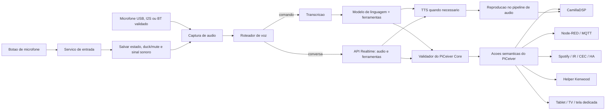

# Controle por Voz e IA

## Status

Conceito arquitetural adotado para implementacao futura. Esta diretriz define
como o PiCeiver deve usar uma API de IA para compreender voz, controlar o
sistema e oferecer perguntas e conversas gerais, sem entregar a uma API
externa acesso direto ao sistema operacional.

Os modelos, precos e endpoints concretos devem permanecer configuraveis. Eles
nao fazem parte do contrato interno do PiCeiver e podem mudar sem alterar as
acoes de controle.

## Intencao

Transformar o botao de microfone do controle remoto em uma entrada natural
para todo o PiCeiver. O usuario deve poder misturar portugues, alemao e ingles,
inclusive em nomes de artistas, albuns, musicas e dispositivos.

Exemplos de uso:

- `toque Deutschland do Rammstein no Spotify`;
- `mude para a TV e coloque o volume em menos trinta decibeis`;
- `schalte auf Spotify und spiele Aguas de Marco`;
- `qual e a distancia entre a Terra e a Lua?`;
- continuar uma conversa curta e ouvir a resposta pelo sistema de som.

A IA atua como camada de compreensao e decisao. O PiCeiver Core continua sendo
a autoridade que valida e executa cada acao.

## Principios

- usar `push-to-talk`: ouvir apenas enquanto houver uma intencao explicita;
- reduzir ou silenciar o audio do programa durante a captura e a resposta;
- nunca permitir que o modelo execute shell, MQTT ou APIs internas livremente;
- oferecer somente ferramentas pequenas, tipadas e previamente autorizadas;
- validar limites e estado novamente no Pi antes de executar uma ferramenta;
- manter comandos locais utilizaveis quando a Internet ou a IA falhar;
- usar resposta falada apenas quando ela trouxer informacao util;
- separar o caminho economico de comandos do caminho de conversa natural;
- registrar uso, latencia, resultado e custo sem armazenar audio por padrao;
- manter credenciais somente no Pi, fora da interface web e do repositorio.

## Arquitetura proposta



O caminho exato para injetar a voz no pipeline ALSA/CamillaDSP ainda deve ser
definido e validado. A resposta deve entrar antes do controle final de volume,
dos limites de seguranca e do roteamento de canais; ela nao deve contornar o
CamillaDSP nem reproduzir diretamente em uma saida ALSA concorrente.

## Ciclo push-to-talk

### Ao pressionar o botao

1. receber o evento do controle Bluetooth;
2. guardar fonte, volume, mute e estado de reproducao;
3. aplicar `duck` ou mute somente ao audio do programa;
4. reproduzir um sinal curto de que a captura comecou;
5. abrir o microfone e a sessao de captura;
6. indicar `ouvindo` na interface externa.

### Enquanto o botao estiver pressionado

- capturar audio sem aplicar os filtros destinados ao programa musical;
- opcionalmente enviar o fluxo durante a fala para reduzir latencia;
- detectar falha, silencio excessivo e limite maximo de duracao;
- nunca deixar a captura aberta indefinidamente.

### Ao soltar o botao

1. finalizar a captura;
2. enviar ou concluir o fluxo para a API;
3. interpretar o resultado;
4. validar e executar zero ou mais chamadas de ferramenta;
5. atualizar o estado publicado para todas as interfaces;
6. reproduzir confirmacao, resposta ou erro, quando necessario;
7. restaurar gradualmente o audio do programa;
8. encerrar a sessao ou mante-la por um periodo curto se houver conversa ativa.

O sistema deve tratar cancelamento explicito, perda de rede e nova pressao do
botao durante uma resposta. Uma nova pressao pode interromper a voz da IA sem
alterar por engano o estado da fonte ou do volume.

## Dois modos de operacao

### Comando de controle

Caminho preferido para operacoes cotidianas:

```text
audio -> transcricao -> modelo com ferramentas -> validacao -> acao
```

Este modo deve priorizar baixo custo, baixa latencia e determinismo. A resposta
normal e um sinal sonoro ou uma frase curta. A primeira implementacao pode usar
Whisper ou outro modelo de transcricao da OpenAI, mantendo o transcritor
substituivel.

### Conversa e perguntas gerais

Caminho para perguntas, explicacoes e dialogo:

```text
audio -> sessao de voz Realtime -> audio de resposta -> CamillaDSP
```

Esse modo oferece uma voz mais natural e permite interrupcao da resposta. A
sessao deve ter tempo de inatividade curto, contexto limitado e encerramento
automatico. Perguntas atuais que dependam da Internet so podem usar busca se
essa ferramenta tiver sido explicitamente disponibilizada e autorizada.

O roteador pode inferir o modo depois da primeira fala, mas comandos obvios nao
devem abrir uma conversa Realtime longa. A interface deve mostrar claramente
quando o sistema esta ouvindo, pensando, executando ou falando.

## Prompt e contexto operacional

O prompt do sistema define o papel do assistente, mas nao substitui validacao
de software. Ele deve informar:

- identidade e finalidade do PiCeiver;
- idiomas esperados e tolerancia a mistura entre eles;
- ferramentas disponiveis e momento correto de uso;
- fontes, zonas e modos atualmente validos;
- preferencia por respostas curtas durante operacao;
- obrigacao de pedir confirmacao para acoes sensiveis ou ambiguas;
- proibicao de inventar dispositivos, estados ou resultados;
- diferenca entre responder uma pergunta e comandar o sistema.

Cada solicitacao deve receber somente o contexto operacional necessario, por
exemplo:

```yaml
power: on
source: spotify
volume_db: -32.5
mute: false
spotify:
  state: playing
  track: Deutschland
  artist: Rammstein
available_sources: [tv, spotify, pc, tvbox, satellite, switch]
```

## Contrato de ferramentas

A integracao deve usar chamadas de ferramentas com esquemas definidos, e nao
JSON livre inventado pelo modelo. Conjunto inicial sugerido:

```text
get_system_state()
set_volume(volume_db, zone)
change_volume(delta_db, zone)
set_mute(enabled)
select_source(source)
play_music(query, provider)
pause_playback()
resume_playback()
next_track()
set_kenwood_mode(mode)
power_system(target_state)
show_screen(screen)
```

As ferramentas representam intencoes. Seus handlers chamam os adaptadores do
PiCeiver Core, que por sua vez podem usar CamillaDSP, Node-RED, MQTT, IR, CEC,
Home Assistant, Spotify ou o helper Kenwood.

Exemplo conceitual de uma decisao:

```json
{
  "tool": "play_music",
  "arguments": {
    "query": "Deutschland Rammstein",
    "provider": "spotify"
  }
}
```

O resultado da ferramenta volta ao modelo quando for necessario formular uma
resposta. O assistente somente deve afirmar que a acao ocorreu depois de o
handler confirmar sucesso.

## Validacao e seguranca

O PiCeiver Core deve aplicar, independentemente do prompt:

- lista fechada de ferramentas e parametros;
- tipos, faixas e enumeracoes em todos os argumentos;
- limite absoluto e limite cotidiano de volume;
- confirmacao para desligar, elevar muito o volume ou executar macros sensiveis;
- serializacao de operacoes que nao podem ocorrer simultaneamente;
- timeout, cancelamento e idempotencia quando aplicavel;
- leitura do estado real antes de sequencias dependentes de estado;
- ausencia de comandos arbitrarios de shell ou acesso direto a credenciais;
- log de solicitacao, ferramenta, argumentos validados, resultado e duracao.

O log nao deve guardar audio nem transcricao completa por padrao. Quando uma
gravacao for habilitada para diagnostico, deve existir indicacao clara,
retencao curta e remocao simples.

## Resposta sonora

Tres niveis sao previstos:

1. **sem fala:** alteracoes simples usam bip e atualizacao visual;
2. **TTS:** confirmacoes, erros e respostas curtas usam voz sintetizada;
3. **voz Realtime:** conversas e perguntas gerais usam audio natural em fluxo.

A reproducao deve ter um barramento logico proprio para permitir:

- interromper a resposta com o botao do microfone;
- limitar o volume da voz independentemente do programa;
- priorizar alertas importantes;
- fazer ducking sem alterar permanentemente o volume escolhido pelo usuario;
- rotear inicialmente para o canal central ou frontais, conforme testes.

Um TTS local pode permanecer como fallback para mensagens essenciais quando a
API estiver indisponivel. Ele nao precisa substituir a voz natural do modo de
conversa.

## Custos e limites

A arquitetura deve evitar depender de um preco ou modelo especifico. O custo
sera controlado por politica local:

- nao enviar audio sem o botao de microfone acionado;
- usar transcricao e ferramenta para comandos simples;
- abrir Realtime somente para conversas ou quando sua baixa latencia for util;
- limitar duracao de captura, resposta falada, contexto e inatividade;
- encerrar sessoes abandonadas;
- coletar os campos de uso retornados pela API;
- mostrar consumo estimado diario e mensal na interface;
- permitir um teto mensal configuravel e degradacao para TTS local/texto;
- nunca tratar a assinatura do ChatGPT como credito da API.

Precos devem ser consultados na pagina oficial no momento da implementacao:

- <https://developers.openai.com/api/docs/pricing>

## Privacidade e credenciais

- a chave da API fica em arquivo de ambiente ou secret acessivel apenas ao
  servico do PiCeiver;
- navegador, tablet, iPad e Node-RED Dashboard nunca recebem essa chave;
- a API de voz do Pi aceita solicitacoes apenas da rede local e de clientes
  autorizados;
- audio temporario deve permanecer em memoria sempre que possivel;
- telemetria deve evitar nomes, falas e dados pessoais desnecessarios;
- deve existir uma indicacao visual clara sempre que o microfone estiver ativo;
- uma opcao local deve desabilitar integralmente o recurso de IA.

## Falhas e degradacao

| Falha | Comportamento esperado |
|---|---|
| sem Internet ou API indisponivel | informar brevemente, restaurar o programa e manter controles locais |
| microfone ausente | nao abrir sessao; mostrar diagnostico na interface |
| transcricao incerta | pedir repeticao sem executar acao ambigua |
| ferramenta invalida | rejeitar no validador e registrar o evento |
| timeout durante uma macro | consultar estado real antes de repetir |
| resposta de voz interrompida | parar apenas o barramento de voz |
| teto de custo atingido | usar funcoes locais e resposta visual/TTS local conforme politica |

O controle Bluetooth tradicional, a interface touch e as automacoes locais
nao podem depender da disponibilidade da IA.

## Integracao com a interface externa

Tablet, TV e futura tela dedicada devem exibir o mesmo estado de voz publicado
pelo PiCeiver Core:

```yaml
voice:
  state: idle
  mode: command
  microphone: available
  api: available
  transcript_preview: null
  pending_confirmation: null
  last_result: null
  month_usage_estimate: null
```

Estados previstos: `idle`, `listening`, `thinking`, `confirming`, `executing`,
`speaking` e `error`. A transcricao nao deve ficar permanentemente visivel nem
ser persistida sem uma escolha explicita.

## Implementacao incremental

### Fase 1 - bancada de voz

- validar microfone USB ou I2S separado do controle;
- mapear pressionar, soltar e cancelar no botao Bluetooth;
- capturar uma fala curta e obter transcricao multilingue;
- mostrar transcricao e estado no painel, sem executar comandos.

### Fase 2 - comandos seguros

- implementar um pequeno conjunto de ferramentas somente leitura e volume;
- integrar `get_system_state`, mute, volume e selecao de fonte;
- adicionar schemas, validacao, limites, logs e mensagens de erro;
- validar portugues, alemao, ingles e frases misturadas.

### Fase 3 - midia e resposta falada

- integrar busca e reproducao do Spotify;
- adicionar TTS para respostas que realmente precisem de voz;
- implementar barramento de voz, ducking e restauracao gradual;
- medir latencia, taxa de sucesso e custo real.

### Fase 4 - conversa moderna

- adicionar sessao Realtime para perguntas e dialogo;
- permitir interrupcao de respostas;
- limitar contexto, tempo de inatividade e gasto mensal;
- avaliar ferramentas opcionais de informacao atual.

### Fase 5 - refinamento

- melhorar resolucao de nomes de musica e dispositivos;
- criar confirmacoes dependentes de risco;
- disponibilizar diagnostico e custo no tablet;
- avaliar se algum comando frequente deve ganhar interpretacao totalmente local.

## Criterios de aceitacao iniciais

- o microfone somente captura durante uma interacao indicada ao usuario;
- audio do programa nao contamina significativamente a gravacao;
- comandos em portugues, alemao, ingles e mistos sao compreendidos nos testes;
- nenhuma resposta do modelo contorna o validador do PiCeiver Core;
- volume nunca ultrapassa o limite local por decisao da IA;
- o sistema confirma sucesso somente depois de receber resultado do executor;
- falha de Internet nao afeta volume, fontes ou controle Bluetooth tradicionais;
- a resposta de voz percorre o pipeline seguro de audio e pode ser interrompida;
- interface mostra claramente ouvir, pensar, executar, falar e falhar;
- custo e latencia podem ser medidos por tipo de interacao.

## Decisoes ainda pendentes

- identificar se o controle Bluetooth realmente oferece um perfil de microfone
  utilizavel ou se o botao acionara um microfone USB/I2S separado;
- escolher o primeiro microfone e medir ruido, eco e distancia;
- definir o ponto de injecao da voz no ALSA/CamillaDSP;
- definir schemas e niveis de confirmacao das primeiras ferramentas;
- escolher modelos iniciais por qualidade, latencia e custo no momento da
  implementacao;
- definir duracao maxima de captura, timeout de sessao e teto mensal;
- decidir se transcricoes temporarias aparecerao na interface;
- avaliar cancelamento de eco somente se o push-to-talk e o ducking nao forem
  suficientes.

## Referencias

- precos da API: <https://developers.openai.com/api/docs/pricing>
- modelos disponiveis: <https://developers.openai.com/api/docs/models>
- interface externa: [`external-control-interface.md`](external-control-interface.md)
- fluxos de controle: [`control-flows.md`](control-flows.md)
- estado atual do audio: [`audio-stack-current-state.md`](audio-stack-current-state.md)
