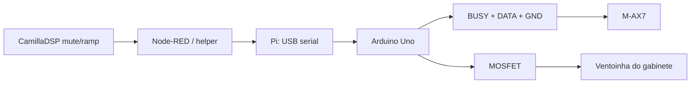

# Kenwood AX-7 System Control (SL16)

## Resultado

O enlace entre o pre-amplificador/receiver `C-AX7` e o amplificador `M-AX7`
foi identificado, capturado, decodificado e reproduzido com sucesso. Nao e um
trigger DC nem um pulso unico: e o barramento serial Kenwood `SL16`, com duas
linhas TTL e referencia comum.

Foram validados em equipamento real:

- ligar o M-AX7 e terminar em quatro canais
- ligar o M-AX7 e terminar em dois canais
- selecionar dois ou quatro canais com o amplificador ligado
- desligar o M-AX7 para standby

O firmware reproduzivel esta em
[`../../firmware/kenwood-sl16-controller/`](../../firmware/kenwood-sl16-controller/).

## Interface fisica confirmada

O cabo correto e TRS de 3,5 mm. Os tres contatos sao obrigatorios:

```text
tip     BUSY
ring    DATA
sleeve  GND/referencia
```

O sistema nao funciona com apenas dois dos tres contatos. Isso corrigiu a
identificacao inicial equivocada do cabo como mono TS.

As duas linhas ficam baixas em repouso. Durante as capturas, os niveis altos
ficaram tipicamente em `4,22 V`, com maior leitura amostrada proxima de
`4,59 V`. O barramento deve ser tratado como logica de `5 V`.

## Captura passiva

Foi usado um Arduino Uno compativel, alimentado apenas por USB:

```text
C-AX7 TIP  ----------------------------- M-AX7 TIP
               |
               +-- 10k -- D2 e A0

C-AX7 RING ----------------------------- M-AX7 RING
               |
               +-- 10k -- D3 e A1

C-AX7 SLEEVE --------------------------- M-AX7 SLEEVE
               |
               +--------- Arduino GND
```

Os resistores ficaram nos ramos de medicao, nao em serie entre os aparelhos.
D2 e D3 registraram todas as bordas por interrupcao; A0 e A1 confirmaram as
tensoes. O Arduino permaneceu como entrada, sem pull-up, durante a captura.

## Formato SL16 medido

Cada transacao usa `TIP/BUSY` alto durante todo o quadro e transmite a palavra
de 16 bits em `RING/DATA`, do bit mais significativo para o menos significativo.

```text
inicio: DATA baixo 5 ms, depois alto 5 ms
bit 1:  DATA baixo 2 ms, depois alto 2 ms
bit 0:  DATA baixo 5 ms, depois alto 2 ms
fim:    DATA baixo, BUSY baixo
gap:    aproximadamente 1 ms entre quadros consecutivos
```

Isso explica as medicoes antigas proximas de `88,7 ms` e `91,7 ms`: eram a
duracao de quadros completos, nao pulsos que por si so codificavam o modo.

## Comandos confirmados

| Operacao | Palavra SL16 | Validacao |
|---|---:|---|
| Selecionar 2 canais (`2 x 50 W`) | `0xBF70` | repetida duas vezes |
| Selecionar 4 canais (`4 x 25 W`) | `0xBFF0` | repetida duas vezes |

As operacoes sao de selecao de estado, nao apenas um toggle: o C-AX7 enviou
palavras diferentes para cada destino.

### Ligar e terminar em quatro canais

Sequencia capturada duas vezes e reproduzida com sucesso no M-AX7 isolado:

```text
0xBFB8
0xBFFF
0xBF74
0xBFF0
0xBF78
```

### Ligar e terminar em dois canais

A forma validada usa a sequencia de power-on acima e envia imediatamente:

```text
0xBF70
```

O M-AX7 saiu do standby e terminou em dois canais.

### Desligar para standby

Sequencia capturada no C-AX7 e reproduzida com sucesso:

```text
0xBF7F
0xBF38
0xBFB8
```

## Reproducao validada com Arduino

Para transmitir, o C-AX7 foi desconectado e o M-AX7 permaneceu ligado somente
ao Arduino:

```text
M-AX7 TIP    -- 10k -- Arduino D2 (BUSY)
M-AX7 RING   -- 10k -- Arduino D3 (DATA)
M-AX7 SLEEVE -------- Arduino GND
```

Mesmo com `10 kohm` em serie em cada linha, todos os testes funcionaram. O
firmware mantem os pinos como `INPUT` no boot, verifica que BUSY e DATA estao
baixos antes de transmitir e volta a alta impedancia depois de cada quadro.

Comandos seriais do firmware, em `115200 baud`:

```text
o  ligar; termina em 4 canais
t  ligar e terminar em 2 canais
f  desligar/standby
2  selecionar 2 canais
4  selecionar 4 canais
s  estado do barramento
h  ajuda
```

## Integracao final com o Raspberry Pi

O Arduino deixa de ser apenas a referencia de bancada e passa a integrar a
arquitetura principal. O Raspberry Pi alimenta e controla o Uno pelo cabo USB;
o Arduino gera o SL16 de 5 V usando o firmware ja validado. Nenhum GPIO do Pi
se conecta ao M-AX7.

Conexao fisica, helper serial, coordenacao com CamillaDSP e controle da
ventoinha do gabinete:

- [`kenwood-sl16-pi-arduino.md`](kenwood-sl16-pi-arduino.md)

A implementacao direta com SPI/GPIO e buffer de nivel permanece em
[`kenwood-sl16-raspberry-pi.md`](kenwood-sl16-raspberry-pi.md) como alternativa
futura, nao como requisito atual.



Fluxo sugerido para ligar:

```text
1. manter CamillaDSP em mute
2. garantir M-AX7 energizado e em standby
3. chamar power_on_4ch ou power_on_2ch no helper
4. aguardar estabilizacao/reles
5. liberar o audio com ramp
```

Fluxo sugerido para desligar:

```text
1. aplicar mute/fade no CamillaDSP
2. chamar power_off no helper
3. confirmar tempo para queda dos reles
4. cortar tomada smart somente se desejado
```

O GPIO direto no Raspberry Pi continua possivel como alternativa, mas nao e a
decisao atual. Exigiria adaptacao segura entre 3,3 V e 5 V; manter o Arduino
reutiliza a interface que ja foi comprovada no equipamento real.

## Regras de seguranca

- nao conectar GPIO do Pi diretamente ao SL16 de 5 V
- nao dirigir o barramento com C-AX7 e Arduino/Pi ao mesmo tempo
- deixar ambas as linhas como entrada/alta impedancia no boot e no repouso
- verificar BUSY e DATA baixos antes de iniciar uma transmissao
- nunca alimentar a ventoinha por GPIO ou pelo pino 5 V do Arduino
- desligar os aparelhos da tomada antes de alterar o cabeamento

## Estado do trabalho

Concluido:

- pinout TRS e identificacao SL16
- captura simultanea de BUSY e DATA
- decodificacao do formato de 16 bits
- comandos de 2 e 4 canais
- sequencias de ligar e desligar
- reproducao de todas as operacoes no M-AX7 real
- firmware Arduino versionado

Pendente:

- criar helper serial no Pi e integrar ao Node-RED
- coordenar mute/ramp do CamillaDSP
- montar e validar modulo MOSFET e ventoinha do gabinete
- ampliar o firmware com D4 e cooldown da ventoinha
- definir caixa, conectores e protecao eletrica definitivos
