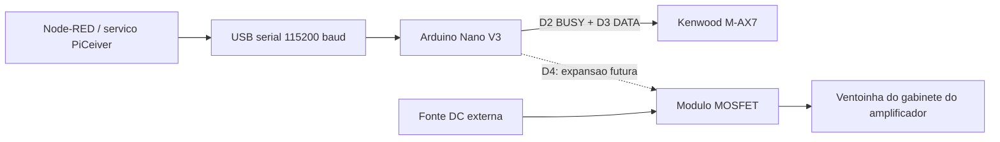

# Controle do M-AX7 pelo Pi e Arduino Nano

## Decisao atual

A implementacao do PiCeiver usa um Arduino Nano V3 compativel, com ATmega328P
de 5 V/16 MHz, como controlador eletrico do Kenwood M-AX7. O Raspberry Pi 3
Model B orquestra o sistema e envia comandos ao Nano pelo mesmo cabo USB usado
para alimentacao. O Nano gera o barramento Kenwood SL16 com a temporizacao ja
validada no amplificador real.



Essa solucao foi escolhida porque o mesmo firmware e a mesma familia
ATmega328P ja ligaram, desligaram e comutaram o M-AX7 com sucesso. O Nano e o
unico componente que gera ou recebe os sinais eletricos do SL16.

## Conexao Pi-Arduino

O Raspberry Pi usa sua fonte normal. Um cabo USB-A para USB-C entre o Pi e o
Nano:

- alimenta o Nano com 5 V;
- cria a porta serial USB;
- transporta os comandos e as respostas.

Nao e necessario nenhum GPIO entre Pi e Arduino. O software do Pi deve
localizar a porta por `/dev/serial/by-id/`, e nao assumir que ela sera sempre
`/dev/ttyUSB0`.

O alvo final e o AZ-Nano V3 USB-C com ATmega328P, logica de 5 V/16 MHz e
conversor USB serial CH340. No Linux ele normalmente aparece como
`/dev/ttyUSB*`; o helper deve usar um caminho persistente por `by-id`, quando
disponivel, ou `by-path`.

## Conexao Nano-M-AX7

O C-AX7 deve ficar desconectado quando o Arduino controla o barramento:

```text
M-AX7 TIP   / BUSY  -- 10 kohm -- Nano D2
M-AX7 RING  / DATA  -- 10 kohm -- Nano D3
M-AX7 SLEEVE / GND  ----------- Nano GND
```

Os tres contatos do cabo TRS sao obrigatorios. Os pinos D2 e D3 ficam como
entrada/alta impedancia no boot, no repouso e depois de cada quadro.

## Protocolo serial atualmente gravado

A porta opera em `115200 baud`. O Pi envia um caractere por operacao:

| Caractere | Operacao |
|---|---|
| `o` | ligar e terminar em 4 canais |
| `t` | ligar e terminar em 2 canais |
| `f` | desligar para standby |
| `2` | selecionar 2 canais |
| `4` | selecionar 4 canais |
| `s` | consultar as linhas SL16 |
| `h` | ajuda |

Ao abrir a serial, o Pi deve aguardar
`KENWOOD_SL16_CONTROLLER_READY`. Abertura da porta pode reiniciar o Nano por
DTR; o firmware e seguro porque inicia com o SL16 em alta impedancia e nao
transmite automaticamente.

O helper do Pi deve serializar as operacoes, aplicar timeout, registrar a
resposta completa e somente considerar sucesso depois de receber o fim da
sequencia sem `ABORT` ou `SEQUENCE_ABORTED`.

O helper implementado e `scripts/kenwood_sl16_control.py`. Ele encontra a
serial por `/dev/serial/by-id/`, oferece `on`, `off`, `toggle`, `2ch`, `4ch` e
`status`, e registra apenas comandos confirmados em
`runtime/kenwood-state.json`. Como o SL16 nao revela o estado fisico de energia,
`toggle` usa o ultimo comando confirmado; estado ausente ou desconhecido
resulta em `on`.

## Integracao com Node-RED e CamillaDSP

Fluxo de ligar:

```text
1. aplicar mute/fade no CamillaDSP
2. energizar o M-AX7 e esperar standby, se houver tomada smart
3. abrir/localizar o Arduino e confirmar READY
4. enviar "o" para 4 canais ou "t" para 2 canais
5. confirmar a sequencia no retorno serial
6. aguardar estabilizacao dos reles
7. liberar o audio com ramp
```

Fluxo de desligar:

```text
1. aplicar fade/mute no CamillaDSP
2. enviar "f" e confirmar a sequencia
3. aguardar queda dos reles
4. manter o mute enquanto o M-AX7 estiver em standby
5. cortar a tomada smart somente se desejado
```

Regra atual do botao POWER do G20S: `off` confirmado termina com
`CamillaDSP mute=true`; `on` confirmado em 4 canais aguarda a estabilizacao
dos reles e termina com `CamillaDSP mute=false`. O mute tambem permanece
ativo se a operacao falhar ou o estado eletrico ficar incerto.

Reiniciar o Pi, o servico ou o Arduino nunca deve enviar automaticamente
power-on, power-off ou troca de canais.

## Expansao futura: ventilacao do gabinete

Se os testes termicos mostrarem necessidade, o Nano podera controlar uma
ventoinha adicional para refrigerar o gabinete do M-AX7. Essa funcao nao esta
implementada nem e requisito para o primeiro funcionamento. A ventoinha nao
sera alimentada por um pino do Nano; uma fonte DC dimensionada para a carga a
alimentara atraves de um modulo MOSFET.

Modulo selecionado como candidato: Dual MOSFET Trigger Switch, carga DC
`5-36 V`, entrada logica `3,3-20 V` e PWM ate `20 kHz`. Para uma ventoinha
pequena, sua capacidade anunciada e mais que suficiente; as alegacoes de
`15 A/400 W` nao devem ser usadas como criterio de projeto sem ensaio termico.
O produto avaliado e o Medrialife ASIN `B0GL1NWZQH`:

- [pagina do modulo na Amazon.de](https://www.amazon.de/dp/B0GL1NWZQH)

Pinagem planejada, a confirmar pelos rotulos e fotos do modulo recebido:

```text
Nano D4  ----------------------- Trigger/PWM+
Nano GND ----------------------- Trigger/PWM-
                                  |
Fonte externa negativa -----------+-- POWER/VIN-
Fonte externa positiva -------------- POWER/VIN+
Ventoinha positiva ------------------ OUT+
Ventoinha negativa ------------------ OUT-
```

Regras eletricas:

- manter terra comum entre Nano, entrada de controle e negativo da fonte;
- nunca unir o positivo da fonte externa ao pino `5V` do Nano;
- a fonte deve ter a mesma tensao nominal da ventoinha;
- usar fusivel proximo da fonte, dimensionado para os fios e para a carga;
- confirmar se o modulo possui protecao para carga indutiva; se nao possuir,
  avaliar o diodo de flyback apropriado para o tipo de ventoinha;
- ventoinha de dois fios pode ser chaveada diretamente; em modelos de tres
  fios, o tacometro pode ficar sem uso; modelos de quatro fios devem
  preferencialmente usar a entrada PWM propria para controle de velocidade.

## Logica futura da ventoinha

`D4` deve iniciar em `LOW`, evitando partida durante reset. A extensao do
firmware deve manter estado explicito do amplificador:

- depois de `o` ou `t` concluir sem erro: colocar `D4=HIGH`;
- em troca entre 2 e 4 canais: manter a ventoinha ligada;
- depois de `f`: manter a ventoinha durante um cooldown configuravel e entao
  colocar `D4=LOW`;
- se o estado do amplificador for incerto depois de falha de comunicacao,
  preferir manter a ventoinha ligada enquanto o Nano continuar energizado.

O cooldown sugerido inicialmente e `60 s`, mas deve ser confirmado em teste
termico. Tambem deve existir um comando serial de diagnostico para forcar a
ventoinha temporariamente, sem alterar o estado SL16.

## Implementacao pendente

- receber o modulo MOSFET e conferir seus terminais e protecoes;
- registrar tensao, corrente, quantidade de fios e sentido de fluxo da
  ventoinha;
- adicionar D4, estado e cooldown ao firmware do Nano somente se a expansao
  for aprovada;
- integrar helper, mute/ramp e tratamento de falhas ao Node-RED;
- testar reset e desconexao USB sem comando SL16 espurio;
- validar temperaturas do gabinete em 2 e 4 canais e ajustar o cooldown.
