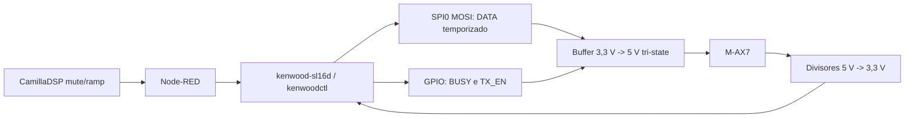

# Kenwood SL16 direto no Raspberry Pi (alternativa futura)

> **Status:** este projeto foi substituido como arquitetura principal pela
> conexao Pi -> USB serial -> Arduino -> M-AX7. Ele permanece como referencia
> para uma possivel versao futura sem Arduino. A decisao atual esta em
> [`kenwood-sl16-pi-arduino.md`](kenwood-sl16-pi-arduino.md).

## Objetivo e status

Este documento preserva o projeto alternativo para o Raspberry Pi substituir
o Arduino e gerar SL16 diretamente. Ele nao e requisito da implementacao
principal atual.

Status:

- protocolo, palavras e sequencias: **validados no M-AX7 real**
- firmware Arduino de referencia: **validado**
- circuito e helper GPIO/SPI do Pi: **alternativa nao implementada**

Resultados de bancada e firmware de referencia:

- [`kenwood-ax7-system-control.md`](kenwood-ax7-system-control.md)
- [`../../firmware/kenwood-sl16-controller/`](../../firmware/kenwood-sl16-controller/)

## Arquitetura alternativa

O Pi sera o orquestrador e tambem gerara o SL16:



DATA sera produzido pelo periferico SPI, e nao por `sleep()` em Python. O SPI
mantem os intervalos de bit independentes da carga e do scheduler do Linux.
BUSY e TX_EN usam GPIOs comuns porque mudam apenas no inicio e no fim de cada
quadro.

O backend SPI e preferido a depender de `pigpio`, pois deve ser validavel em
Pi 4 e Pi 5. A documentacao atual do Raspberry Pi recomenda as interfaces GPIO
mantidas pelo kernel e alerta que os GPIOs sao de 3,3 V; o SL16 medido chega a
aproximadamente 5 V e exige adaptacao de nivel:

- [GPIO e tensoes do Raspberry Pi](https://www.raspberrypi.com/documentation/computers/raspberry-pi.html#gpio-and-the-40-pin-header)
- [boas praticas atuais de GPIO](https://pip-assets.raspberrypi.com/categories/685-whitepapers-app-notes-compliance-guides/documents/RP-006553-WP/A-history-of-GPIO-usage-on-Raspberry-Pi-devices-and-current-best-practices)

## Plataforma detectada no PiCeiver

Leitura direta do Pi montado em `V:` por SSHFS em `elvis@192.168.178.117`:

```text
Modelo:     Raspberry Pi 3 Model B Rev 1.2
Revision:   a02082
Compatible: raspberrypi,3-model-b / brcm,bcm2837
Sistema:    Debian GNU/Linux 13 (trixie), versao 13.3
```

O arquivo `/boot/firmware/config.txt` ainda nao contem `dtparam=spi=on`; foram
encontrados apenas outros parametros, incluindo `enable_uart=1`. Portanto, SPI
deve ser habilitado antes de implementar o helper:

```text
dtparam=spi=on
```

Depois de reiniciar, confirmar a existencia de `/dev/spidev0.0`. Essa alteracao
nao foi aplicada durante a documentacao.

Comandos de inventario para repetir depois de atualizacoes:

```bash
tr -d '\0' </proc/device-tree/model
uname -a
cat /etc/os-release
gpiodetect
gpioinfo
ls -l /dev/spidev* /dev/gpiochip*
```

Neste Pi 3, as linhas do conector sao fornecidas pelo controlador BCM2837. O
helper ainda deve descobrir/validar o gpiochip durante a instalacao em vez de
depender silenciosamente de um numero fixo.

## Pinagem proposta no conector de 40 pinos

Numeracao BCM proposta. A busca nos backups atuais de Node-RED, CamillaDSP e
scripts nao encontrou uso de GPIO/SPI, mas a pinagem deve ser conferida de novo
no hardware antes da montagem:

| Funcao | GPIO BCM | Pino fisico | Observacao |
|---|---:|---:|---|
| `DATA_TX` | GPIO10 | 19 | SPI0 MOSI |
| `BUSY_TX` | GPIO17 | 11 | saida comum |
| `TX_EN` | GPIO27 | 13 | habilita o buffer por transistor |
| `BUSY_RX` | GPIO22 | 15 | leitura depois do divisor |
| `DATA_RX` | GPIO23 | 16 | leitura depois do divisor |
| GND | - | 6 | referencia comum |
| 5 V | - | 2 ou 4 | alimenta somente o buffer |

GPIO2 e GPIO3 nao foram escolhidos porque possuem pull-ups fixos na placa. O
clock SPI GPIO11 e os chip-selects nao se conectam ao M-AX7.

## Interface eletrica obrigatoria

### Componentes propostos

- `1 x 74AHCT125` alimentado em 5 V
- `1 x NPN` pequeno, por exemplo BC547 ou 2N3904
- `2 x 1 kohm` em serie nas saidas SL16
- `2 x 15 kohm` e `2 x 22 kohm` para os divisores de leitura
- `2 x 1 kohm` em serie imediatamente antes dos GPIOs de leitura
- `1 x 4,7 kohm` na base do NPN
- `1 x 100 kohm` base-emissor do NPN
- `1 x 10 kohm` de pull-up dos pinos `/OE` para 5 V
- `1 x 100 nF` entre VCC e GND do 74AHCT125
- conector TRS de 3,5 mm e caixa isolante

O sufixo `AHCT` e importante: sua entrada reconhece os 3,3 V do Pi como nivel
alto mesmo quando o CI e alimentado em 5 V. A peca exata e seu datasheet devem
ser conferidos antes da montagem.

### Saidas BUSY e DATA

```text
GPIO10 / SPI MOSI ---- 74AHCT125 A1
74AHCT125 Y1 -------- 1k -------- RING / DATA do M-AX7

GPIO17 -------------- 74AHCT125 A2
74AHCT125 Y2 -------- 1k -------- TIP / BUSY do M-AX7

/OE1 e /OE2 ----+---- 10k ---- +5 V
                |
              coletor NPN
GPIO27 -- 4k7 -- base
base ----- 100k ----- GND
emissor ------------ GND
```

`TX_EN=0` mantem o NPN desligado e o pull-up deixa o 74AHCT125 em alta
impedancia. `TX_EN=1` liga o NPN, leva `/OE` a zero e habilita simultaneamente
BUSY e DATA. Assim, o buffer continua desabilitado durante boot, shutdown,
crash ou GPIO ainda nao configurado.

### Entradas de verificacao

Cada linha SL16 deve ser lida por um GPIO separado, depois de um divisor:

```text
TIP/BUSY  -- 15k --+-- 1k -- GPIO22 / BUSY_RX
                   |
                  22k
                   |
                  GND

RING/DATA -- 15k --+-- 1k -- GPIO23 / DATA_RX
                   |
                  22k
                   |
                  GND
```

Com 5 V no barramento, o divisor fornece aproximadamente 2,97 V. Isso fica
acima do limiar alto do Pi e abaixo de 3,3 V mesmo com alguma variacao da
alimentacao. Confirmar com multimetro antes de conectar BUSY_RX e DATA_RX.

### Restricao de coexistencia

A primeira versao nao permite C-AX7 e Pi dirigindo o mesmo barramento. O C-AX7
deve permanecer desconectado quando o buffer do Pi puder ser habilitado. Os
resistores serie limitam corrente acidental, mas nao substituem arbitragem.

## Geracao deterministica por SPI

Configurar SPI0 em modo 0, MSB primeiro, a `200 kbit/s`. Cada bit SPI dura
`5 us`; assim, as duracoes SL16 viram quantidades inteiras de bytes:

| Segmento SL16 | Duracao | Bits SPI | Bytes |
|---|---:|---:|---:|
| inicio baixo | 5 ms | 1000 | 125 x `0x00` |
| inicio alto | 5 ms | 1000 | 125 x `0xFF` |
| bit `1` baixo | 2 ms | 400 | 50 x `0x00` |
| bit `0` baixo | 5 ms | 1000 | 125 x `0x00` |
| separador alto | 2 ms | 400 | 50 x `0xFF` |

Adicionar um byte `0x00` ao fim garante DATA baixo antes de baixar BUSY; isso
acrescenta apenas `40 us`, proximo do intervalo final observado.

Pseudocodigo:

```python
def encode_sl16(word: int) -> bytes:
    wave = bytearray([0x00] * 125 + [0xFF] * 125)
    for mask in (1 << bit for bit in range(15, -1, -1)):
        wave += bytes([0x00]) * (50 if word & mask else 125)
        wave += bytes([0xFF]) * 50
    wave += b"\x00"
    return bytes(wave)
```

Sequencia de transmissao:

```text
1. TX_EN=0; BUSY_TX=0
2. abrir SPI e enviar um byte zero ainda com o buffer desabilitado, deixando
   MOSI/DATA baixo
3. ler BUSY_RX e DATA_RX; abortar se alguma estiver alta
4. TX_EN=1 e aguardar 100 us
5. BUSY_TX=1
6. transferir o buffer SPI completo
7. BUSY_TX=0
8. TX_EN=0
9. aguardar aproximadamente 1 ms antes de outro quadro
```

O buffer SPI do pior quadro fica abaixo de 4 KiB. Mesmo assim, verificar:

```bash
cat /sys/module/spidev/parameters/bufsiz
```

## Palavras e macros do helper

| Operacao publica | Quadros SL16 |
|---|---|
| `power_on_4ch` | `BFB8 BFFF BF74 BFF0 BF78` |
| `power_on_2ch` | sequencia acima, depois `BF70` |
| `set_2ch` | `BF70` |
| `set_4ch` | `BFF0` |
| `power_off` | `BF7F BF38 BFB8` |

Todas foram validadas previamente no M-AX7 usando o Arduino.

## Helper e estado de software

Implementar dois componentes pequenos:

```text
kenwood-sl16d   processo unico que possui GPIO e SPI
kenwoodctl      cliente CLI usado pelo Node-RED e por diagnostico
```

Interface sugerida:

```bash
kenwoodctl power-on --channels 4
kenwoodctl power-on --channels 2
kenwoodctl channels 2
kenwoodctl channels 4
kenwoodctl power-off
kenwoodctl status
```

O daemon deve:

- iniciar com TX_EN desabilitado e nunca transmitir automaticamente no boot
- manter exclusao mutua para impedir quadros sobrepostos
- validar palavra entre `0x0000` e `0xFFFF`, mas expor somente macros conhecidas
- verificar barramento baixo antes de cada quadro
- registrar timestamp, operacao, palavras, duracoes e resultado
- retornar erro se o barramento estiver ocupado
- voltar a alta impedancia em `finally`, sinal ou excecao
- manter estado logico `UNKNOWN`, `STANDBY`, `ON_2CH` ou `ON_4CH`
- tratar o estado como estimativa ate existir decodificacao de respostas

Configuracao proposta em `/etc/piceiver/kenwood-sl16.toml`:

```toml
[gpio]
busy_tx = 17
tx_enable = 27
busy_rx = 22
data_rx = 23

[spi]
device = "/dev/spidev0.0"
speed_hz = 200000

[timing]
inter_frame_ms = 1.0
enable_settle_us = 100
```

O GPIO de DATA e implicitamente o MOSI do SPI0.

## Integracao com systemd

Servico proposto: `piceiver-kenwood-sl16.service`.

Requisitos:

- usuario dedicado membro dos grupos necessarios a GPIO e SPI
- acesso apenas ao gpiochip e spidev usados
- `Restart=on-failure`
- `NoNewPrivileges=true`
- TX_EN desligado antes de abrir o socket/API
- handler de encerramento que desabilita TX_EN

Nao configurar `ExecStartPre` que transmita para o amplificador. Reiniciar o
servico nao pode ligar, desligar ou trocar canais.

## Integracao com Node-RED e CamillaDSP

### Ligar

```text
1. CamillaDSP mute/fade para silencio
2. energizar tomada smart do M-AX7, se usada
3. aguardar o M-AX7 chegar a standby
4. kenwoodctl power-on --channels 4 (ou 2)
5. aguardar reles e estabilizacao
6. liberar mute com ramp
```

### Desligar

```text
1. aplicar fade/mute no CamillaDSP
2. kenwoodctl power-off
3. aguardar queda dos reles
4. cortar tomada smart somente depois, se desejado
```

Falha do helper deve manter audio mutado e nao deve provocar repeticao infinita
de power-on/power-off.

## Plano de validacao

### Sem o M-AX7

1. Confirmar TX_EN desabilitado durante boot, reboot e shutdown do Pi.
2. Medir entradas e saidas do 74AHCT125.
3. Confirmar BUSY/DATA em 0 V no repouso e proximo de 5 V no ativo.
4. Confirmar BUSY_RX/DATA_RX nunca acima de 3,3 V.
5. Capturar todos os quadros com Arduino ou analisador logico.
6. Decodificar e comparar byte a byte com as palavras documentadas.
7. Medir `2 ms`, `5 ms` e gap entre quadros.

### Com o M-AX7

1. C-AX7 fisicamente desconectado.
2. M-AX7 em standby; testar `power_on_4ch`.
3. Desligar; testar `power_on_2ch`.
4. Alternar 2/4 canais dez vezes.
5. Repetir o mesmo estado para confirmar idempotencia pratica.
6. Testar `power_off` dez vezes.
7. Reiniciar o daemon e o Pi, confirmando ausencia de comando espurio.
8. Executar pelo menos 100 ciclos automatizados com audio mutado e registrar
   qualquer falha.

Aceitacao minima:

- nenhuma ativacao durante boot/reset
- 100% dos quadros decodificados com as palavras esperadas
- duracoes de 2 e 5 ms dentro de `+/- 0,2 ms`
- nenhuma entrada do Pi acima de 3,3 V
- 100 ciclos sem estado incorreto do amplificador

## Pendencias antes da implementacao

- conferir fisicamente se os GPIOs propostos estao livres
- habilitar SPI com `dtparam=spi=on`, reiniciar e confirmar `/dev/spidev0.0`
- adquirir e montar o estagio 74AHCT125/divisores
- implementar `kenwood-sl16d` e `kenwoodctl`
- validar primeiro sem amplificador e depois em bancada
